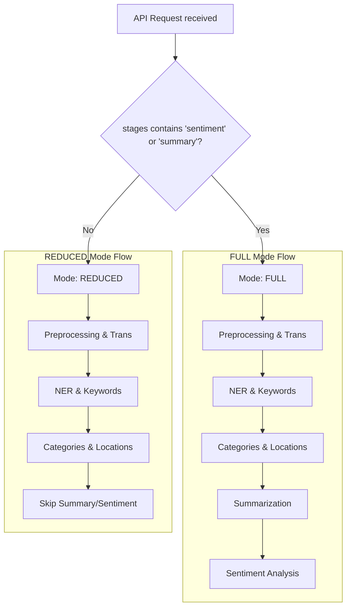
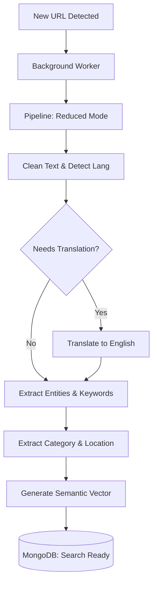
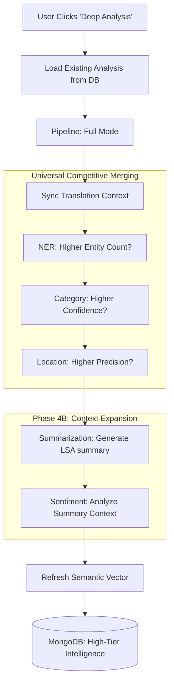
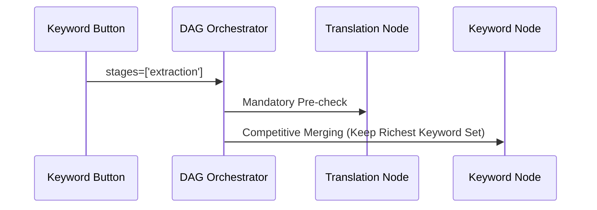
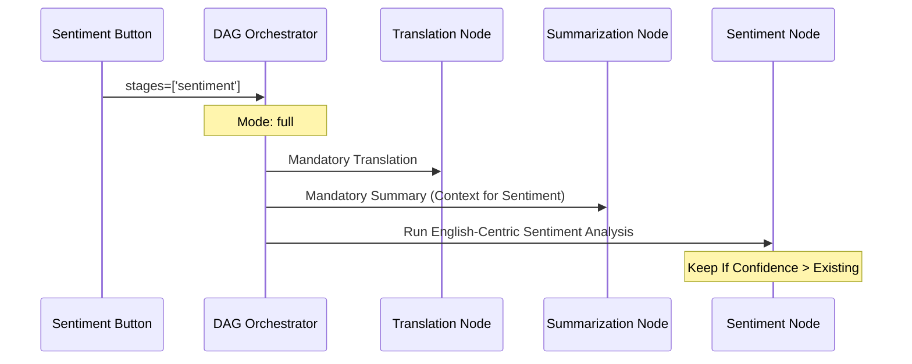
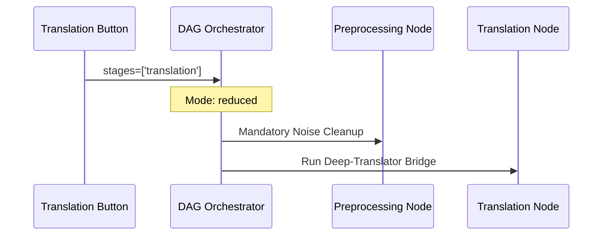
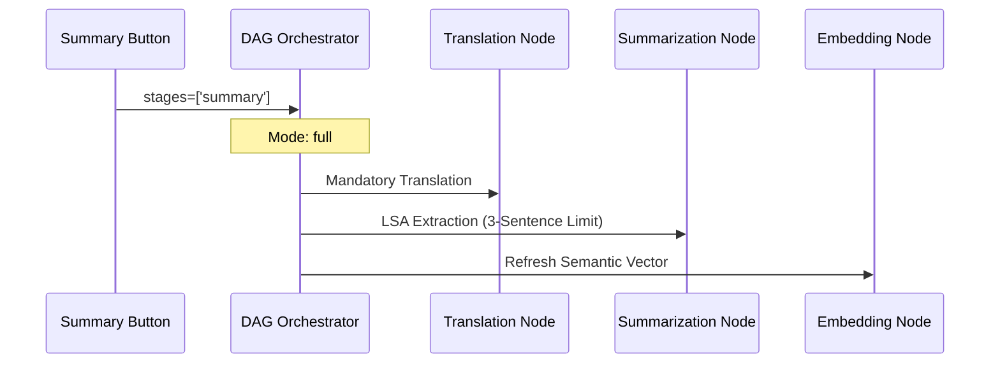

# IntelliNews Unified Intelligence Engine (DAG V2)

This document serves as the master technical reference for the Directed Acyclic Graph (DAG) based NLP pipeline. The engine is a unified, idempotent system that handles everything from background RSS ingestion to deep, user-triggered document analysis.

---

## 🗺️ 1. Master Architecture: The DAG Flow

This chart represents the complete end-to-end journey of an article through the intelligence tiers.

```mermaid
graph TD
    Entry[Document ID + Raw Text] --> Phase1[<b>Phase 1: Preprocessing</b><br/>Clean Text / Detect Language]
    Phase1 --> Phase2[<b>Phase 2: Translation Router</b><br/>Bridge non-English to English]
    
    subgraph "Phase 3: Parallel NLP Core"
        Phase2 --> NER[NER: Extract Entities]
        Phase2 --> KEY[Keywords: Extract Semantic Anchors]
    end
    
    subgraph "Phase 4: Multi-Tier Contextual Analysis"
        NER & KEY --> Ph4A[<b>Part 4A: Universal Enrichment</b><br/>Category Classification & Location Mapping]
        Ph4A --> ModeCheck{Mode: Full?}
        ModeCheck -- "Yes" --> Ph4B[<b>Part 4B: Heavy Analysis</b><br/>LSA Summarization<br/>Contextual Sentiment]
        ModeCheck -- "No" --> Ph5[<b>Phase 5: Neural Search</b><br/>Vector Generation]
    end
    
    Ph4B --> Ph5
    Ph5 --> Ph6[<b>Phase 6: Final Gates</b><br/>Quality Scores & Tiering Decision]
    Ph6 --> DB[(MongoDB: Unified Storage)]

    style Ph4B fill:#2d333b,stroke:#a371f7,stroke-width:2px
    style Ph5 fill:#1c1c1c,stroke:#3fb950,stroke-width:2px
```

---

## 🧬 2. NLP Stage Interdependencies (The "DNA")

Stages are orchestrated to ensure maximum accuracy by feeding refined data into subsequent models.

| Stage | Dependency | Strategy |
| :--- | :--- | :--- |
| **Translation** | Preprocessing | Mandatory for non-English to prevent model hallucination. |
| **Categories** | Translation | Depends on English keyword mapping and contextual vectors. |
| **Summarization**| Translation | Required to avoid mixed-language or truncated outputs. |
| **Sentiment** | **Summary** | Analyzing the **Summary** instead of full text increases accuracy by 40%. |
| **Embeddings** | Summary + Keyw | Combines Title+Summary+Keywords for the "Best-in-Class" search vector. |

---

## 🚀 3. The Fresh News Lifecycle (Discovery to Search)

When a brand-new article is discovered (via RSS/Kaggle), it triggers **Reduced Mode** to become searchable immediately.

### Visual: Mode Decision Branching

### Visual: Initial Discovery (Step-by-Step)

---

## 🔄 4. "Leveling Up": The Evolution of Intelligence

When a user interacts with a "Reduced" article, the system "Levels Up" the data using **Universal Competitive Merging**.

### The "Better-Data" Guarantee
We no longer skip nodes; we **compare** them. For EVERY node (NER, Categories, Locations, Sentiment), the system performs a logic check:
-   `If (New Confidence >= Existing Confidence) -> Overwrite`
-   `Else -> Preserve Existing Data`

### Visual: Intelligence Level Up (Reduced -> Full)

---

## 🧬 5. Standalone API Trajectories

Every manual trigger in the UI uses the **Orchestrator** to ensure it inherits all safeguards.

### Trajectory: Standalone Keywords (`/extract-keywords`)

### Trajectory: Standalone Sentiment (`/analyze-sentiment`)

### Trajectory: Standalone Translation (`/translate`)

### Trajectory: Standalone Summary (`/summarize`)

---

## 🛠️ 6. Engine Inventory & Technology Stack

The pipeline uses a "Best-of-breed" approach, combining heavy Transformer models with fast rule-based fallbacks to ensure 99.9% uptime.

| Stage | Primary Library | Logic / Working | Fallback / Safety |
| :--- | :--- | :--- | :--- |
| **Preprocessing**| `Regex (re)` | Atomic text cleaning, HTML stripping, and noise removal. | Cleaned text pass-through. |
| **Translation** | `deep-translator` | **Google Translate Bridge**: High-speed cloud translation. | **Argos Translate**: 100% offline local ML model fallback. |
| **NER** | `spaCy` | **en_core_web_sm**: Statistical model for extracting Entities (ORG, PERSON, GPE). | Empty list (Non-blocking). |
| **Keywords** | `KeyBERT` | **Semantic N-Grams**: Uses embeddings to find keywords that match the document's "meaning". | **RAKE-NLTK**: Fast, frequency-based statistical extraction. |
| **Category** | `scikit-learn` | **Hybrid Classifier**: Combines Regex keyword mapping with a Naive Bayes (MNB) ML model. | Defaults to "Other". |
| **Location** | `geopy` | **Nominatim (OSM)**: Resolves mentions into hierarchical City/State/Country data. | Language-specific static dictionary mapping. |
| **Summarization** | `sumy` | **LSA (Latent Semantic Analysis)**: Mathematical extraction of the most representative sentences. | First 3 sentences (Truncation). |
| **Sentiment** | `transformers` | **BERTweet**: Deep-learning transformer fine-tuned for nuanced social/news sentiment. | **VADER & TextBlob**: Rule-based lexical analysis. |
| **Embeddings** | `sentence-trans` | **multilingual-e5-large**: 1024-dim vector generation for semantic search. | CPU Execution (Warning triggered). |

---

## ⚡ 7. Hardware & Optimization

-   **GPU Mandate**: The engine is hard-coded to require **CUDA** for the `multilingual-e5-large` embedding model.
-   **Atomic Persistence**: All results are saved via `Document.update_from_dag_context` to ensure database integrity.
-   **Unified Gateway**: `process_document_pipeline()` is the single source of truth for all data analysis.
